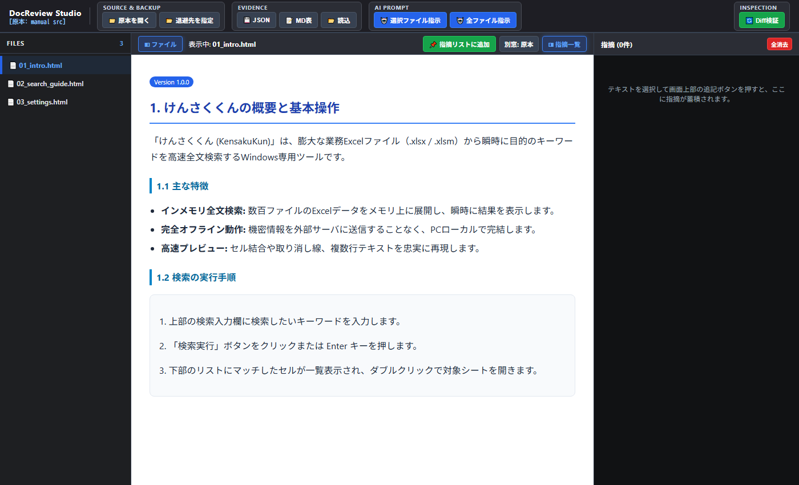
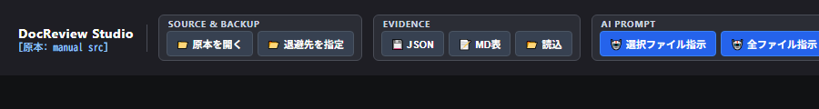
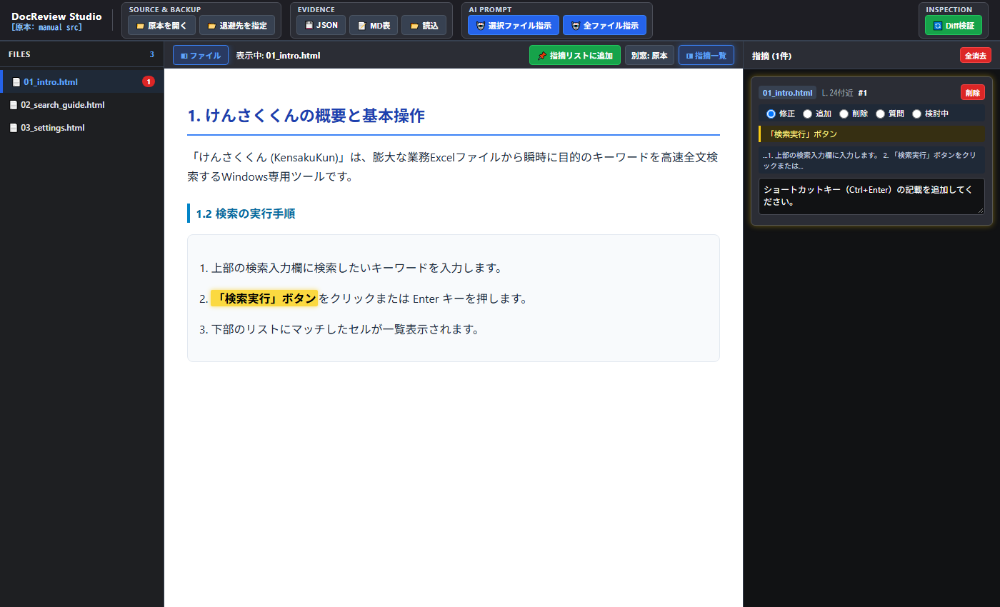
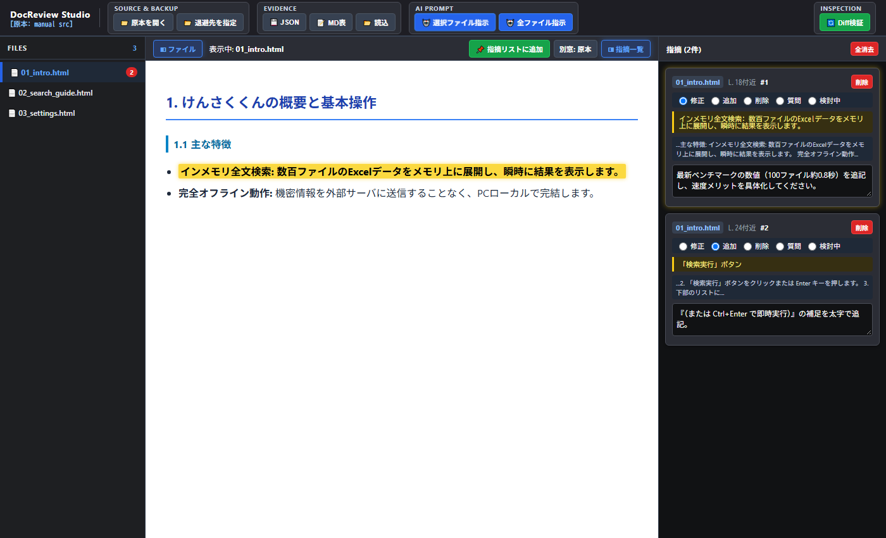
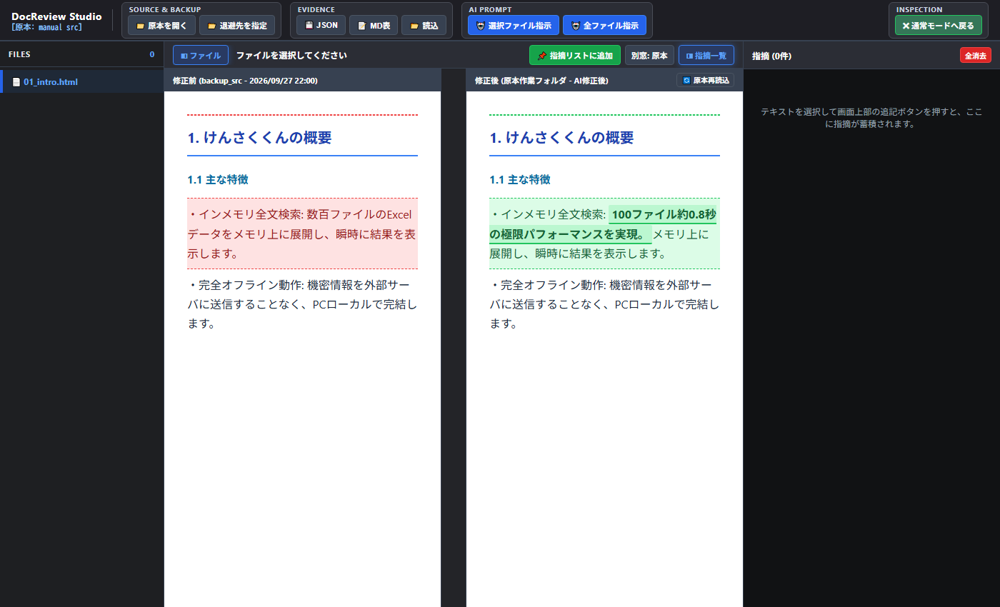
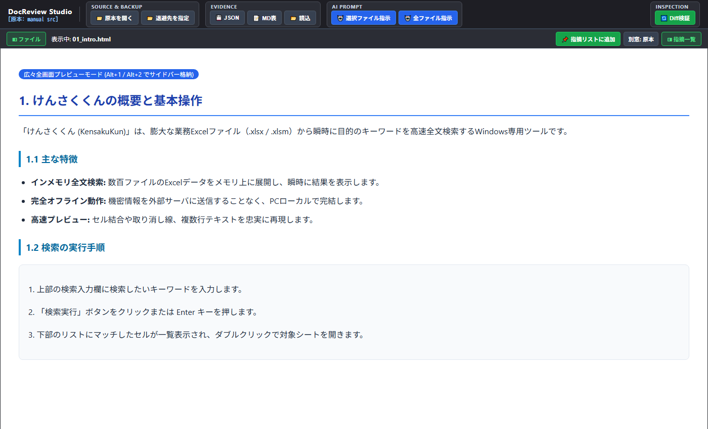

# DocReview Studio ユーザーズマニュアル

DocReview Studio は、ブラウザ単体でローカルのHTMLマニュアルやMarkdownドキュメント（.md / .markdown）を読み込み、直感的なレビュー指摘の記録、AI修正指示プロンプトの自動生成、WinMerge風の左右Diff差分検証を行える**完全クライアントサイド型 AI協働ドキュメント校正スタジオ**です。

---

## 📑 目次

[1. DocReview Studio の特徴・設計思想](#sec-features)
[2. 画面構成（UIレイアウト）](#sec-layout)
[3. クイックスタート（AI協働改修の基本フロー）](#sec-quickstart)
[4. 基本レビュー手順（指摘の記録・エビデンス管理）](#sec-review)
[5. AIプロンプト連携（LLM指示の一括生成）](#sec-aiprompt)
[6. WinMerge風 Diff差分検証機能](#sec-diff)
[7. 便利な操作・ショートカット・拡張機能](#sec-shortcuts)

---

## 1. DocReview Studio の特徴・設計思想



### 🤖 人間とAIが協働する「ドキュメント改修サイクル」
- **人間は「直感的に指摘するだけ」**: 本文のテキストをドラッグ選択して指示を入力するだけで、LLM（Claude, Gemini, ChatGPT 等）が迷わず直接修正を実行できる高精度プロンプト（対象ファイル・概算行番号・対象テキスト・前後文脈・修正指示）を一括自動生成します。
- **AI修正後の結果を「Diff検証で安全確認」**: AIがファイルを書き換えた後は、ワンクリックで最新データを再読込。退避した修正前原本との左右並列Diff（WinMerge風）により、「指示通りに修正されたか」「予期せぬ余計な崩れがないか」を目視で即座に検証できます。

### 🔒 サーバー通信ゼロ・完全ローカル完結
- **File System Access API** を採用し、PCローカルのフォルダやファイルをブラウザ内部メモリで直接読み込み・操作します。
- 社外秘のドキュメントや未公開マニュアル、個人情報が含まれる文書であっても、外部サーバーへ一切送信されません。

### 📝 HTML & Markdown（.md）の高速プレビュー
- HTMLファイルだけでなく、Markdownドキュメント（.md / .markdown）も自動でGitHub風スタイル付きHTMLに高速変換してプレビュー表示・差分検証できます。
- オフラインでも動作するローカル内蔵パーサー（`marked.min.js`）を同梱。

### 🚀 インストーラー不要・即座に起動
- Chromium系ブラウザ（**Google Chrome**、**Microsoft Edge**、**Brave** 等）があれば、インストール作業や環境構築なしで即座に利用可能です。

---

## 2. 画面構成（UIレイアウト）

DocReview Studio は、効率的な校正作業のために設計された**3ペイン構造**を採用しています。

| エリア | 名称 | 主な役割 |
| :--- | :--- | :--- |
| **ヘッダー** | コントロールバー | 原本・退避フォルダ指定、JSON/MD保存、AI指示コピー、Diff検証切替 |
| **左ペイン** | ファイルツリー | 対象フォルダ内のHTML/Markdownファイル一覧（検索フィルタ・種別バッジ付） |
| **中央ペイン** | プレビュー / Diff検証 | HTML/Markdown本文のリアルタイムレンダリング、左右並列差分比較 |
| **右ペイン** | 指摘一覧（Evidence） | 選択テキスト、概算行番号、指摘区分、指示入力カードの一覧管理 |

---

## 3. クイックスタート（3ステップで始める）



### STEP 1: 原本フォルダを開く
1. ヘッダー左側の **「📁 原本を開く」** ボタンをクリックします。
2. レビュー・校正対象のHTMLまたはMarkdownファイル群が含まれるローカルフォルダを選択し、アクセスを許可します。
3. 左ペインにファイル一覧が読み込まれます（上部の検索ボックスで絞り込みも可能）。

### STEP 2: 退避先フォルダを指定する（原本バックアップ）
1. ヘッダーの **「📂 退避先を指定」** ボタンをクリックします。
2. バックアップ用の空フォルダ（または既存の退避フォルダ）を選択します。
3. 原本ファイル群が自動的にミラー退避され、AI修正前の原本データとして保持されます。

> **💡 ヒント**: 退避フォルダを指定しておくことで、AIによる修正後にワンクリックで「修正前 vs 修正後」の差分比較（Diff検証）を行えるようになります。

### STEP 3: レビュー対象のファイルを選択
- 左側のファイル一覧からレビューしたいファイルをクリックすると、中央ペインにプレビューが表示されます。

---

## 4. 基本レビュー手順（指摘の記録・エビデンス管理）



### 1. 本文テキストを選択して指摘を追加
1. 中央のプレビュー画面で、修正・指摘したいテキストをマウスでドラッグ選択します。
2. プレビュー上部ツールバーの **「📌 指摘リストに追加」** ボタンをクリックします。
3. 右ペインに新しい指摘カードが自動生成され、入力欄にフォーカスが当たります。

### 2. 指摘カードの編集
各指摘カードには以下の情報が自動記録・設定されます：

- **対象ファイル & 概算行番号**: 原本HTML内のテキスト出現位置から `L.24付近` のように概算行を自動算出。
- **指摘区分（ラジオボタン）**: `修正` / `追加` / `削除` / `質問` / `検討中` から選択。
- **対象テキスト（黄色ハイライト枠）**: クリックすると本文プレビューの該当箇所へ自動スクロール＆点滅ハイライトします。
- **文脈（コンテキスト）**: 対象テキストの前後文脈を自動抽出。
- **指示入力（テキストエリア）**: AIや執筆者に伝えたい具体的な指示内容を入力します。

### 3. エビデンスのエクスポート・復元
ヘッダーの **Evidence** グループからレビュー結果を保存・共有できます。

- **💾 JSON**: 指摘データ構造を完全保持したJSONファイルを出力。
- **📝 MD表**: GitHub Issueやレビュー報告書にそのまま貼り付け可能なMarkdownテーブル形式で出力。
- **📂 読込**: 以前保存したJSONファイルを読み込み、指摘カード群を完全復元。

---

## 5. AIプロンプト連携（LLM指示の一括生成）



蓄積した指摘データから、LLM（Claude, Gemini, ChatGPT 等）がそのまま解釈して正確にコード修正できる形式のプロンプトを一括生成します。

### 指示プロンプトのコピー方法
- **🤖 選択ファイル指示**: 現在中央ペインに表示しているファイルに関する指摘のみを整形してクリップボードにコピー。
- **🤖 全ファイル指示**: プロジェクト全体の全ファイルにまたがるすべての指摘を合算してクリップボードにコピー。

#### 生成されるプロンプト形式例
```markdown
以下のドキュメントレビュー指摘に基づき、HTMLファイルを修正してください。

【対象ファイル】01_intro.html
---
■ 指摘 1 [修正] (L.18付近)
・対象テキスト: インメモリ全文検索: 数百ファイルのExcelデータをメモリ上に展開し、瞬時に結果を表示します。
・文脈: ...主な特徴: インメモリ全文検索: 数百ファイルのExcelデータをメモリ上に展開し、瞬時に結果を表示します。 完全オフライン動作...
・指示: 最新ベンチマークの数値（100ファイル約0.8秒）を追記し、速度メリットを具体化してください。

■ 指摘 2 [追加] (L.24付近)
・対象テキスト: 「検索実行」ボタン
・文脈: ...2. 「検索実行」ボタンをクリックまたは Enter キーを押します。 3. 下部のリストに...
・指示: 『（または Ctrl+Enter で即時実行）』の補足を太字で追記。
```

---

## 6. WinMerge風 Diff差分検証機能



AIやエディタによるHTML修正が完了したら、ヘッダー右側の **「🔄 Diff検証」** ボタンを押してビジュアル差分比較モードへ切り替えます。

### Diff Inspector の主な機能
1. **左右並列ブロック比較**:
   - **左ペイン**: 修正前（退避フォルダの原本データ）
   - **右ペイン**: 修正後（作業フォルダの最新データ）
2. **中央 Canvas ブリッジライン**:
   - 左右の対応する差分ブロック間に美しい接続ブリッジラインを描画し、どこがどのように変更されたかを視覚的に把握できます。
3. **スクロール自動同期**:
   - 一方の画面をスクロールすると、もう一方も対応位置へスムーズに追従します。
4. **🔄 原本再読込ボタン**:
   - AIがファイルを書き換えた際、アプリをリロードすることなくワンクリックで最新の作業ファイルを再読込して差分を即座に再評価します。

---

## 7. 便利な操作・ショートカット・拡張機能



### ⌨️ キーボードショートカット
作業領域を広く使いたい場合、キーボード操作で瞬時にサイドバーの開閉が可能です。

| ショートカット | 機能 |
| :--- | :--- |
| `Alt + 1` | 左ペイン（ファイルツリー）の表示 / 非表示トグル |
| `Alt + 2` | 右ペイン（指摘一覧）の表示 / 非表示トグル |

> **💡 UIステータス**: ツールバーの **「◧ ファイル」** **「◨ 指摘一覧」** ボタンは、開いている時は**鮮やかなブルー**、閉じている時は**ネオングリーン**に発色し、状態が一目で分かります。

### 🖥️ マルチディスプレイ向け「独立別窓」表示
ヘッダーツールバーのボタンから、原本や修正前ドキュメントをブラウザの**独立別ウィンドウ**としてポップアップ起動できます。

- **「別窓: 原本」**: 現在選択中の原本HTMLを別ウィンドウで大きく表示。
- **「別窓: 修正前」**: 退避フォルダの修正前HTMLを別ウィンドウで起動。

マルチモニター環境で「左画面に原本」「右画面に修正後」を最大化して比較レビューを行う際に最適です。
